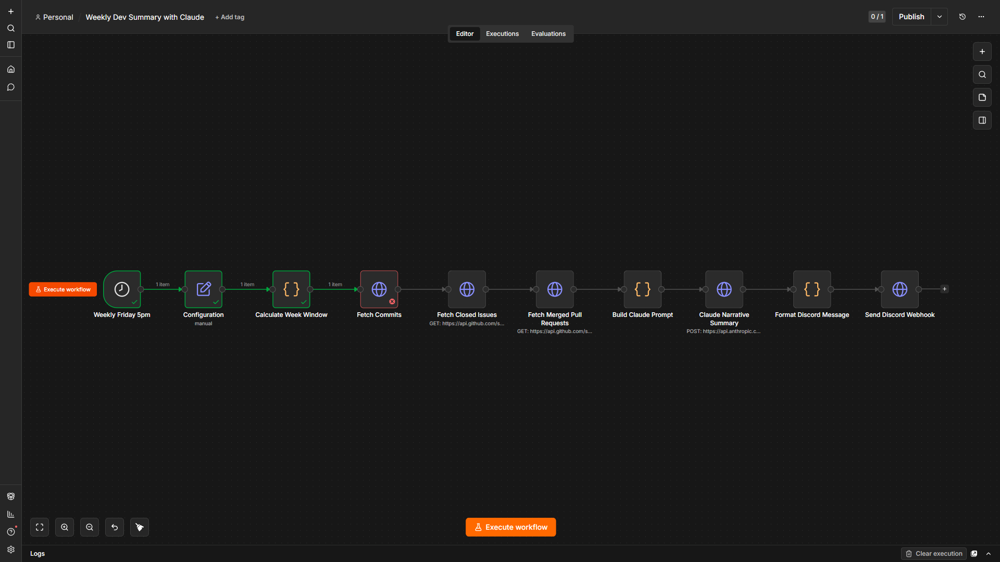

# Weekly Dev Summary Workflow

Importable n8n workflow that generates a weekly narrative summary for a GitHub repository with Claude and posts it to a Discord webhook.

## Setup

1. Import `workflow.json` into n8n.
2. Set these n8n environment variables: `GITHUB_OWNER`, `GITHUB_REPO`, `GITHUB_TOKEN`, `ANTHROPIC_API_KEY`, `SUMMARY_DESTINATION_WEBHOOK_URL`, and `SUMMARY_LANGUAGE` (`EN` or `FR`).
3. Open the workflow and confirm the `Weekly Friday 5pm` schedule matches your n8n instance timezone.
4. Run the workflow manually once, then confirm the Discord channel receives the generated summary.
5. Activate the workflow.

## What It Does

- Runs weekly on Friday at 5pm.
- Fetches the last 7 days of commits, closed issues, and merged pull requests from the GitHub API.
- Calls Claude with `claude-sonnet-4-20250514` to produce a concise narrative summary.
- Posts the Markdown summary to Discord using `SUMMARY_DESTINATION_WEBHOOK_URL`.
- Supports English and French through `SUMMARY_LANGUAGE`.

## Successful Execution Screenshot

A sanitized screenshot of the workflow running on a local n8n instance is included at:

```text
weekly-dev-summary-workflow/screenshots/successful-execution.png
```



The screenshot was captured with `N8N_BLOCK_ENV_ACCESS_IN_NODE=false` and demo placeholder values for the secret environment variables, so the trigger, `Configuration`, and `Calculate Week Window` nodes all complete in green and pass `1 item` downstream. The subsequent HTTP request nodes (Fetch Commits / Issues / PRs, Claude, Discord webhook) require real `GITHUB_TOKEN`, `ANTHROPIC_API_KEY`, and `SUMMARY_DESTINATION_WEBHOOK_URL` values to complete the chain end-to-end on your own instance — those are intentionally kept out of the screenshot per the bounty guidance.

No API keys, webhook URLs, private repository names, account names, or personal data are visible in the screenshot.

## Local Validation

```bash
bash weekly-dev-summary-workflow/validate.sh
```
